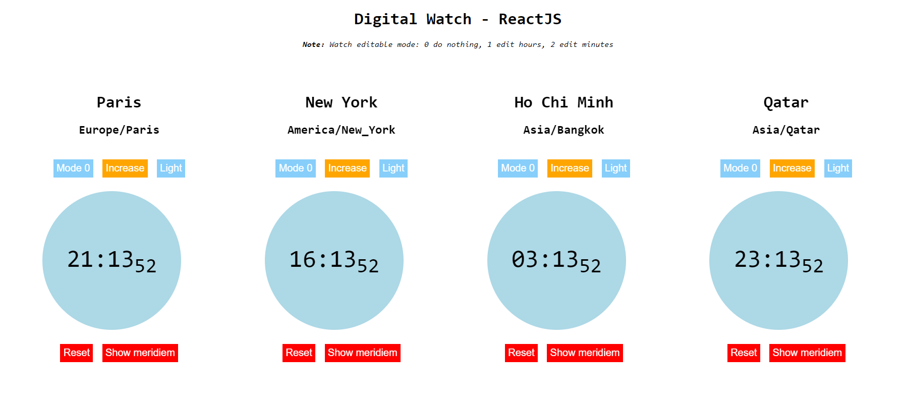

# Digital Watch - ReactJS App
Digital Watch ReactJS project
Using TypeScript and ReactJS to create many digital watch by timezones and Stopwatch.

## Demo

[Live Demo](https://digital-watch-yenguyen.netlify.app/)



## Run

- Clone the Repo
  ```bash
  git clone https://github.com/yennguyenthihoang/digital-clock-react-app.git
  cd digital-clock-react-app
  ```
- Install Node Modules
  ```bash
  npm install
  ```
- Build
  ```bash
  npm run build
  ```
- Run
  ```bash
  npm start
  ```
  The App will be live at `http://localhost:3000/`

